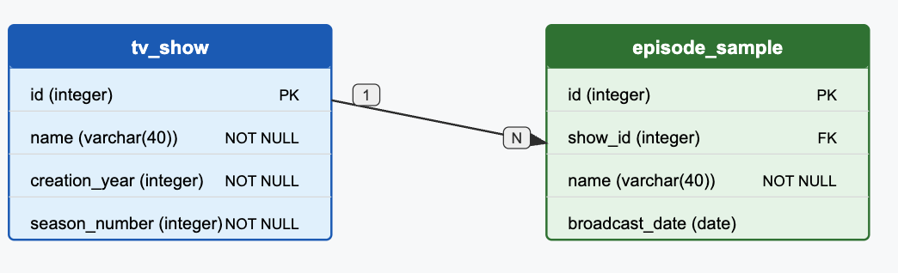

# TV Show Database Queries

This document outlines SQL queries for analyzing TV show data.

## Database Schema




## Query 1: The number of TV shows available in the tv_shows table

```sql
SELECT COUNT(*) AS total_tv_shows FROM tv_show;
```

## Query 2: The oldest TV show (name) available in the tv_shows table

```sql
SELECT name, creation_year 
FROM tv_show 
ORDER BY creation_year ASC 
LIMIT 1;
```

## Query 3: The TV show (name) with the highest number of episodes in the episode_sample table

```sql
SELECT tv.name, COUNT(ep.id) AS episode_count
FROM tv_show tv
JOIN episode_sample ep ON tv.id = ep.show_id
GROUP BY tv.name
ORDER BY episode_count DESC
LIMIT 1;
```


## Query 4: The TV show (name) with the longest episode title in the episode_sample table

```sql
SELECT tv.name, ep.name AS episode_name, LENGTH(ep.name) AS title_length
FROM tv_show tv
JOIN episode_sample ep ON tv.id = ep.show_id
ORDER BY title_length DESC
LIMIT 1;
```

## Query 5: The most recent episode by TV show

```sql
SELECT 
    tv.name,
    ep.episode_name,
    ep.broadcast_date
FROM (
    SELECT DISTINCT ON (show_id) 
        show_id, 
        name AS episode_name, 
        broadcast_date
    FROM episode_sample
    ORDER BY show_id, broadcast_date DESC
) ep
JOIN tv_show tv ON ep.show_id = tv.id
ORDER BY ep.broadcast_date DESC;
```
